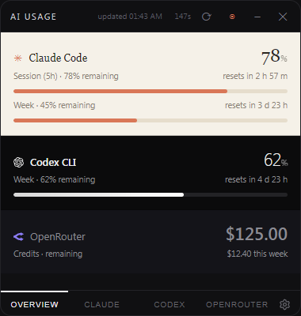
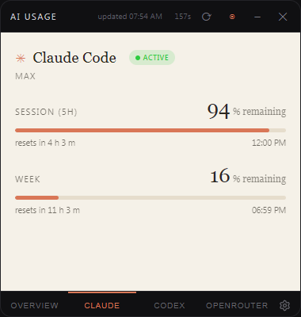
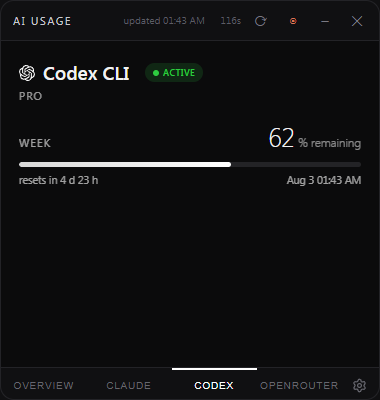
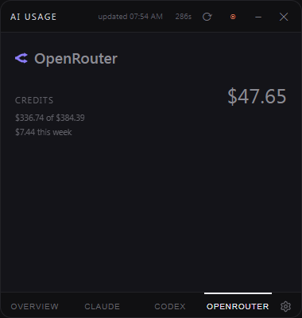
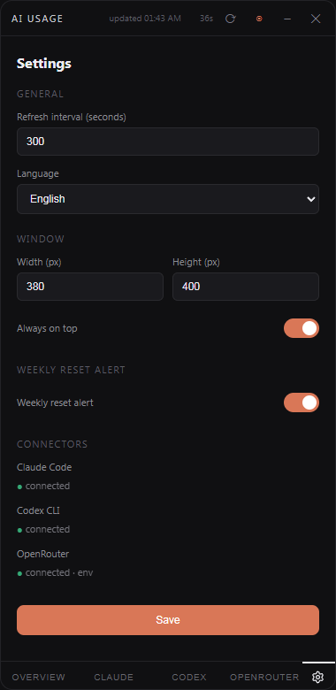
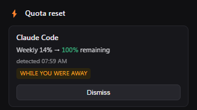

# AI Usage Widget for Windows -- Claude Code, Codex CLI & OpenRouter Usage Tracker

A free, open-source Windows desktop widget for monitoring **Claude Code**, **Codex CLI**, and **OpenRouter** usage in real time. It shows session and weekly quotas, reset countdowns, account status, and an OpenRouter dollar balance in an always-on-top window and the Windows system tray -- plus a persistent alert when a weekly quota resets.

[](https://github.com/jspicher/ai-usage-widget)
[](#license)

This is a fork of [Trafalgardi/ai-usage-widget](https://github.com/Trafalgardi/ai-usage-widget) with a third provider, weekly reset alerts, and several fixes described below.



## Claude Code, Codex, and OpenRouter usage monitor for Windows

AI Usage Widget helps Windows users track Claude Code, Codex CLI, and OpenRouter usage without repeatedly opening each CLI or dashboard. It works as an always-on-top desktop widget and as a system tray quota monitor.

Use it as a:

- Claude Code usage widget for Windows
- Codex CLI usage tracker
- OpenRouter credit balance monitor
- Rate-limit and reset-time tracker
- Windows system tray usage monitor

## Features

### Overview

- Real-time usage for Claude Code, Codex CLI, and OpenRouter
- Session and weekly usage shown together, each with its own remaining percentage and reset countdown
- OpenRouter credit balance in dollars, since it isn't a time-windowed quota
- Plan and account status
- Additional model limits when available

### Screens

1. **Overview** -- every connected provider at a glance: Claude's session and weekly rows, Codex's weekly row, and OpenRouter's dollar balance
2. **Claude** -- session, weekly usage, and Opus weekly usage when available
3. **Codex** -- weekly usage, plan, and additional model limits. Some plans return only a weekly window and no session window; the card reflects whatever the API actually reports
4. **OpenRouter** -- remaining credit balance, total and used, and spend for the current week
5. **Settings** -- refresh interval, window size, language, always-on-top mode, and the weekly reset alert toggle

### Status indicators

- **Active** -- token is valid
- **Expiring** -- less than one hour remains
- **Expired** -- login is required
- **Red usage bar** -- 85% or more of the limit has been consumed
- **Refresh countdown** -- seconds until the next automatic update

### Weekly reset alerts

The widget watches each provider's weekly window and raises a dedicated alert window when it resets, so a quota refilling doesn't go unnoticed between checks.

- A small always-on-top window appears in the corner of the screen. It does not steal keyboard focus, and it stays until you dismiss it.
- Detection compares two `resets_at` timestamps to each other, never against the wall clock -- so changing your system clock cannot fabricate an alert. A reset is flagged when the weekly window's reset timestamp advances by more than an hour, or when the remaining percentage jumps by 10 or more points.
- Resets are tracked across restarts in both directions: if a reset happened while the app was closed, it's reported and tagged "while you were away"; an alert you haven't dismissed yet reappears the next time the app starts.
- Configurable in `config.json` under a `reset_alert` block (`enabled`, `pct_jump_threshold`, `resets_at_advance_sec`), with a toggle in Settings.

### Windows system tray

Minimize the app to the Windows system tray while it continues updating in the background.

- **One static icon** -- the app icon, not one icon per provider. Upstream drew the remaining
  percentage as text onto a separate icon for each of Claude and Codex, so the tray collected two
  numbered squares that also vanished whenever a provider returned an error. The tray now holds a
  single icon that stays put from launch until exit.
- Hover for per-provider detail: each provider's **weekly** remaining percentage and reset
  countdown, plus the OpenRouter balance. The tooltip reports the same window the reset alert
  watches, so the two never disagree.
- Right-click to show, refresh, or exit

Because the tray icon is registered under a new name, Windows may place it behind the overflow
chevron the first time you run this version. Drag it onto the taskbar once and Windows will
remember.

### Quick login

When a token expires, the widget displays a **Login via CLI** button and starts `claude auth login` or `codex login` in a separate window.

## Download and installation

### Run from source

Requirements:

- Windows 10 or Windows 11
- Python 3.10+
- WebView2 Runtime

Create the project virtual environment and install the pinned dependencies:

```powershell
install.bat
```

`install.bat` creates `.venv` and installs the exact versions in
`requirements.txt`. Run the widget with:

```powershell
.\.venv\Scripts\python.exe widget.py
```

Or double-click `start_widget.vbs` to launch without a console window.
The launcher shows a clear message if `install.bat` has not been run yet.

### Build your own executable

See [Build a Windows executable](#build-a-windows-executable) below if you'd rather run a single `.exe` than launch from source.

### Start automatically with Windows

1. Press `Win+R`.
2. Enter `shell:startup`.
3. Add a shortcut to `start_widget.vbs` or your packaged executable.

## Screenshots

**Claude** -- session and weekly windows, each with its own remaining percentage, reset countdown, and reset clock time.



**Codex** -- the weekly window, correctly labelled. On plans that expose no session window, this is the only window the API returns.



**OpenRouter** -- remaining credit balance, spend against total purchased, and spend for the current week.



**Settings** -- refresh interval, language, window size, the weekly reset alert toggle, and read-only connector status.



**Weekly reset alert** -- stays on screen until dismissed, and does not take keyboard focus.



## Privacy and data sources

The widget sends requests only to the service endpoints used for retrieving account usage. Credentials are read locally from the same files used by the official CLIs, or from environment variables.

| Service | Local credential source | Usage endpoint | Documented? |
|---|---|---|---|
| Claude Code | `~/.claude/.credentials.json` | `api.anthropic.com/api/oauth/usage` | No -- undocumented, may change |
| Codex CLI | `~/.codex/auth.json` | `chatgpt.com/backend-api/wham/usage` | No -- undocumented, may change |
| OpenRouter | `OPENROUTER_API_KEY` env var, or `openrouter.api_key` in `config.json` | `openrouter.ai/api/v1/credits`, `openrouter.ai/api/v1/key` | Yes -- publicly documented and supported |

You must already be logged in through each CLI using `/login`, `claude auth login`, or `codex login`. For OpenRouter, set `OPENROUTER_API_KEY` in your environment; the app never writes an API key to disk itself.

The Claude and Codex usage endpoints are undocumented and may change. If a card stops updating after a CLI update, open an issue with the error details. OpenRouter's `/credits` and `/key` endpoints are part of its public API and are expected to remain stable.

## Settings

The Settings screen supports:

- Refresh interval: 15-600 seconds
- Window width and height, side by side (200-800 px wide, 300-1200 px tall)
- Always-on-top mode
- Weekly reset alert on/off
- Read-only connector status for each provider (connected / not configured, and where the credential came from)
- Russian and English interface languages
- A visible scrollbar on this page only, since it's the one screen with more content than fits at the default window size
- Visible `config.json` load/write health. If the file is corrupt, automatic
  geometry persistence leaves it untouched; an explicit Settings save first
  backs it up as `config.json.corrupt-<timestamp>.bak`.

Example `config.json`:

```json
{
  "language": "en",
  "refresh_interval_sec": 300,
  "reset_alert": {
    "enabled": true,
    "pct_jump_threshold": 10,
    "resets_at_advance_sec": 3600
  },
  "window": {
    "width": 380,
    "height": 400,
    "on_top": true,
    "x": null,
    "y": null
  }
}
```

Only documented configuration keys are retained in memory. Unsupported or
retired hand-added keys are ignored when loading and are omitted the next time
the widget saves `config.json`.

Defaults are 300-second refresh, English, and a 380x400 window. Russian is still available from the language dropdown, it's just no longer the default.

The window remembers a manual drag-resize the same way it remembers position -- not just where you left it, but the size you last set it to.

## Troubleshooting

### HTTP 401 or 403

The token or API key has expired or been rejected. Use **Login via CLI** for Claude/Codex, or check `OPENROUTER_API_KEY` for OpenRouter.

### Empty window

Install Microsoft Edge WebView2 Runtime. It is included with Windows 11 and most current Windows 10 installations.

### Red usage bar

The remaining quota is 15% or less.

### Codex card shows the wrong window length

Codex's API reports a rate-limit window's length as `limit_window_seconds`, but some plans only expose it that way rather than as `window_minutes`. If a card is mislabeling a multi-day window as a 5-hour session (or vice versa), make sure you're on a build that reads `limit_window_seconds` as a fallback -- this was a known issue on plans that return only a weekly window with no session window (`secondary_window: null`).

### Python icon instead of the app icon

Upstream shipped no `icon/app.ico`, so the window-icon code found nothing to load and the taskbar
button and Alt-Tab entry fell back to the Python feather. Restarting never helped. This fork
generates `icon/app.ico` from `icon/512.png` and commits it, so the same icon now appears in the
tray, the taskbar, and Alt-Tab. If you build from a clean checkout and the feather returns, confirm
`icon/app.ico` is present -- the PyInstaller command below also references it twice.

## Frequently asked questions

### What does AI Usage Widget track?

It tracks available Claude Code and Codex CLI usage limits (session, weekly, reset times, account status when exposed by the service) and your OpenRouter credit balance.

### Is this an API cost tracker?

Partly. For Claude Code and Codex CLI it focuses on subscription and CLI usage limits rather than API billing. For OpenRouter it does show your account's dollar credit balance, since that's how OpenRouter exposes usage.

### Does it work on Windows 10 and Windows 11?

Yes. The app is intended for current Windows 10 and Windows 11 systems with WebView2 available.

### Does it upload my tokens anywhere?

No. The application reads local CLI credential files and an optional environment variable, and requests usage information directly from each service's own endpoint. It does not require a separate account or external database, and it does not write your OpenRouter key to disk.

### Is the project affiliated with Anthropic, OpenAI, or OpenRouter?

No. This is an independent open-source project and is not an official Anthropic, OpenAI, or OpenRouter product.

## Development

### Dependencies

- `pywebview==6.2.1` -- WebView2-based window
- `pystray==0.19.5` -- Windows system tray integration
- `Pillow==12.3.0` -- tray icon generation

The pinned set lives in `requirements.txt` and is installed into `.venv`.

### Project structure

```text
usage-widget/
├── widget.py
├── resetwatch.py
├── ui.html
├── alert.html
├── requirements.txt
├── config.json
├── icon/
├── preview/
├── docs/
├── tests/
├── install.bat
└── start_widget.vbs
```

### Tests

```bash
python -m unittest discover -s tests -t . -v
```

Runs the reset-detection suite plus widget regression coverage for configuration
recovery, credential parsing, timestamps, polling, redaction, and CLI launching.

### Build a Windows executable

```bash
pip install pyinstaller
python -m PyInstaller --onefile --windowed --name="AI-Usage" --icon="icon/app.ico" --add-data "ui.html;." --add-data "alert.html;." --add-data "icon/512.png;icon" --add-data "icon/app.ico;icon" --collect-all pywebview --collect-all pystray widget.py
```

**Where a packaged build keeps its files.** A `--onefile` executable unpacks itself into a temporary
directory that Windows deletes when the process exits, so anything written there is lost between
runs. The app therefore separates the two: bundled read-only assets (`ui.html`, `alert.html`, icons)
are loaded from that temporary directory, while writable state (`config.json`,
`reset-alert-state.json`, and `widget-error.log` if a write ever fails) is kept **next to the
executable**. Put the `.exe` somewhere durable rather than in a temp or downloads folder, or your
settings and reset history will not survive a restart. Running from source keeps everything in the
project directory, as before.

## Website and design notes

The upstream project website source lives in [`docs/`](docs/) and is ready to be published with
GitHub Pages. That directory also holds the design and implementation notes for the additions in
this fork, under `docs/superpowers/`.

## Credits

This project is a fork of [Trafalgardi/ai-usage-widget](https://github.com/Trafalgardi/ai-usage-widget). Vendor marks (the OpenAI mark for Codex, and the OpenRouter mark) are drawn as inline SVG rather than font glyphs, since the previous font-glyph approach rendered as a blank box in WebView2.

## License

MIT, following the upstream project. Note that neither this fork nor
[Trafalgardi/ai-usage-widget](https://github.com/Trafalgardi/ai-usage-widget) currently ships a
`LICENSE` file, so the MIT declaration lives only in these READMEs.

Third-party marks: the OpenAI and OpenRouter glyphs are from
[simple-icons](https://github.com/simple-icons/simple-icons) (CC0), and the settings gear is from
[Lucide](https://github.com/lucide-icons/lucide) (ISC). Vendor logos are trademarks of their
respective owners and are used here only to identify the service each card refers to.
